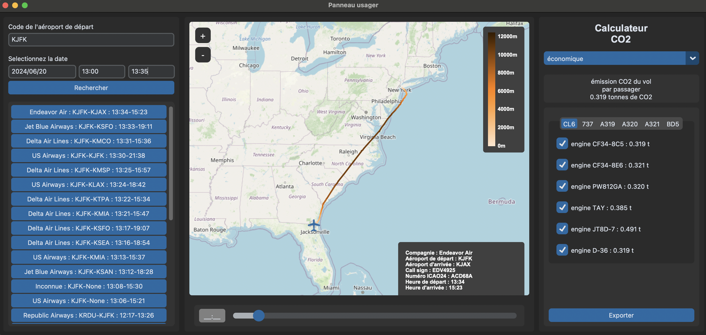

# Traqueur de vol avec calcul d'émission CO2

# Objectif:
Le but de l'application est de calculer l'émission carbone par passager sur un vol ayant déjà eu lieu.

# Guide d'utilisation
Télécharger le dossier GIT et lancer le fichier "main.py".
L'application propose un panneau usager permettant une utilisation de l'application simple et un affichage clair.
### Historique des vols
L'utilisateur fourni le code OACI d'un aéroport, une date et une plage horaire. Il peut ensuite choisir un vol dans la 
liste contenant tous les vols en partant et à destination de son aéroport dans la période fournie. Pour chacun des vols 
de la liste est indiqué : la compagnie aérienne, l'aéroport de départ et d'arrivé ainsi que l'heure de départ et d'arrivée. 
La date doit être comprise dans les 30 jours précédant et la plage horaire supérieure à 30 minutes.
### Affichage du vol
Une fois le vol sélectionné, son itinéraire est affiché sur une carte intéractive avec un gradiant de couleur 
représentant l'évolution de son altitude. Un slider permet revivre l'évolution de la position de l'avion dans le temps (mais n'indique plus l'altitude). 
En bas à droite de la carte des informations sont fournies sur le vol : la compagnie, le code OACI de l'aéroport de départ et d'arrivée,
le callsign, le numéro oaci24 ainsi que l'heure de départ et d'arrivée.
### Calculateur de CO2
Le calculateur de CO2 donne l'émission par passager du vol sélectionné pour une certaine classe. La classe est choisie 
dans un menu déroulant, il y a 4 choix : économie, premium économie, affaire et première.
De plus, l'application offre la possibilité de tester différentes combinaisons de modèles d'avions et moteurs similaires afin de 
rechercher laquelle serait la plus écologique. 
Pour ce faire, il est possible de sélectionner un avion parmi une sélection de modèles d'avion semblable à celui du vol choisit pour
afficher leurs émissions en fonction de divers moteurs.
(Attention les combinaisons ne prennent pas en compte la compatibilité entre 
le moteur et le modèle de l'avion et peut ne pas être réalisable, nous recherchons seulement l'émission la plus faible)
### Fiche de vol
Un bouton "Exporter" permet en cliquant dessus de générer une fiche de vol recensant toutes les informations du vol 
sélectionné. La comparaison d'émissions des moteurs se fera entre ceux ayant leurs cases cochées.

# Interface: 
L'interface est créée avec la librairie customtkinter.

# Gestion de la base de donnée
La base de donnée est composé de 8 bases de données : 
- OpenSky : utilisation de l'api pour récupérer les vols correspondant à l'entrée utilisateur
- callsigne.csv : lie les callsigns aux compagnies
- aircraft_parameters.csv : fournies des informations utiles au calcul de l'émission du vol
- MASTER.csv (fournie par la FAA) : liste tous les avions immatriculés aux États-Unis
- ENGINE.csv (fournie par la FAA) : lie aux avions immatriculés aux US leurs moteurs 
- ACFTREF.csv (fournie par la FAA) : fournie le modèle de chaque avion et le nombre de moteurs équipé
- Gaseous Emissions and Smoke.csv (fournie par l'EASA) : fournies les caractéristiques de nombreux moteurs d'avions
- flight_data.csv : construite à partir de toutes les précedentes, elle contient toutes les informations sur les vols 
correspondant à l'entrée de l'utilisateur

Leurs intéractions peut être représentée comme suit :

Les tableaux représentent les informations contenues dans chaque base de donnée que nous conservons dans
flight_data.csv. 
Les bases de données trouvées sur internet sont téléchargées automatiquement lors du premier lancement de l'application.

# Calcul des émissions :

# Fiche de vol :
La fiche de vol est un document résumant les informations importantes du vol choisit par l'utilisateur, il se présente comme suit :

# Documentation :
La documentation de toutes les fonctions et classes a été générée avec l'outil sphinx et se trouve dans le dossier "Documentation"

# Dépendances :
Toutes les librairies utilisées sont présentes dans le fichier requirement.txt

# Exemple d'exécution 
Un cas test est développé dans le fichier "test.md" du projet.

# Erreurs connues :
Il est possible qu'après avoir cliqué sur le bouton "Rechercher" ou après avoir sélectionné un vol, le message suivant
apparaisse : 
"requests.exceptions.ReadTimeout: HTTPSConnectionPool(host='opensky-network.org', port=443): Read timed out."
Cela indique que l'API d'OpenSky n'a pas répondu dans un délai acceptable. Pour régler le problème, il suffit 
de réitérer une requête. Si cela persiste, cela indique que l'API d'OpenSky n'es pas fonctionnel pour le moment, 
il faut réessayer plus tard.