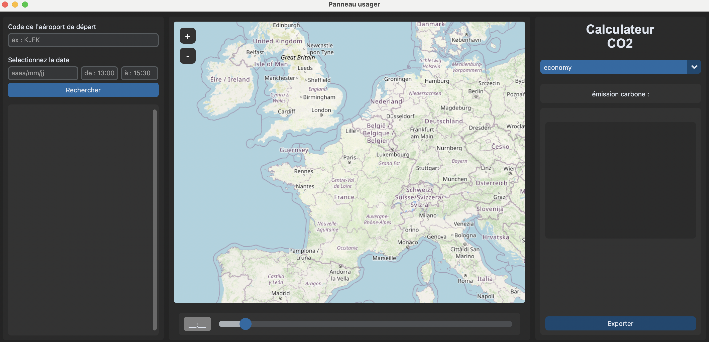
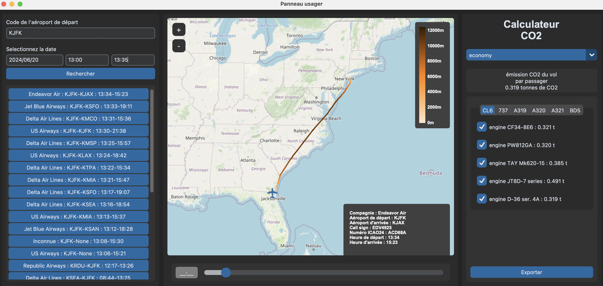
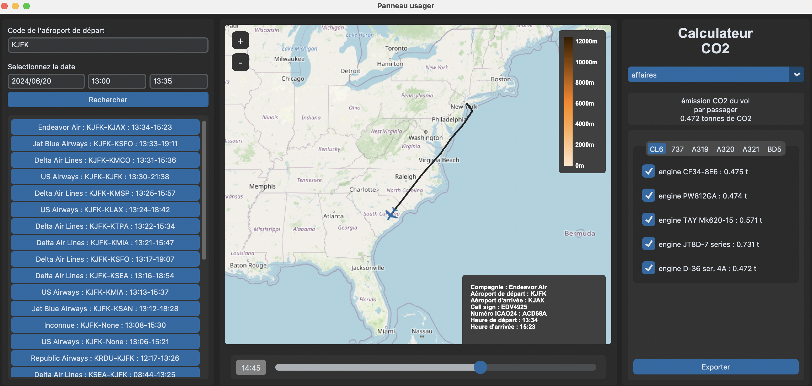

# Cas test du traqueur de vol avec calcul d'émission CO2

Une fois le projet installé et le "main.py" lancée, le panneau usagé se créé :

Nous choisissons comme aéroport celui de New York de code OACI 'KJFK', le 20 juin 2024, sur la plage horaire de 13h00 à 13h35 
et sélectionnons le premier vol : Endeavor Air. On peut observer son itinéraire ainsi que sa consommation pour un 
passager en classe économie, ainsi que pour plusieurs autres modèles de moteurs :

On peut faire glisser le slider et afficher la position de l'avion à 14h12. On change également la classe du passager en
affaire et on observe une augmentation de l'émission.

Enfin, on souhaite récupérer un document résumant le vol, on clique alors sur "Exporter". Un fichier "???" est 

